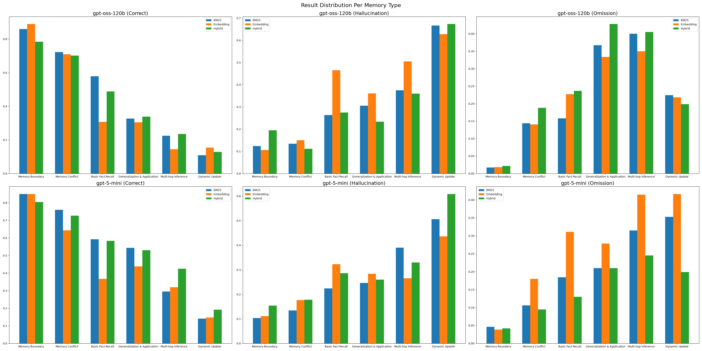

#+title: Retrieval 방법 비교 및 분석
#+startup: shrink inlineimages
* 배경
5번, 7번 실험 위주로 분석하고자 합니다. 실험 세팅은 아래와 같습니다.

#+NAME: experiment-settings
| Experiment | Model        | Dataset | QA Context |
|------------+--------------+---------+------------|
|          5 | gpt-oss-120b | medium  | X          |
|          7 | gpt-5-mini   | medium  | X          |

** 결과 정리
*** Experiment 5
- Overall scores
   #+NAME: exp5-scores
   | Retrieval Type | Correct | Hallucination | Omission |
   |----------------+---------+---------------+----------|
   | BM25           |   42.84 |         17.45 |    39.72 |
   | Embeddings     |   37.45 |         21.84 |    40.71 |
   | Hybrid         |   39.29 |         20.00 |    40.71 |

- BM25
   #+NAME: exp5-bm25
   |                              | Correct | Hallucination | Omission | Total |
   |------------------------------+---------+---------------+----------+-------|
   | Memory Boundary              |     113 |            21 |       28 |   162 |
   | Memory Conflict              |      77 |             9 |       67 |   153 |
   | Basic Fact Recall            |      71 |            29 |       52 |   152 |
   | Generalization & Application |      31 |            37 |       81 |   149 |
   | Multi-hop Inference          |       6 |            11 |       33 |    50 |
   | Dynamic Update               |       4 |            16 |       19 |    39 |
   | Total                        |     302 |           123 |      280 |   705 |

- Embedding
   #+NAME: exp5-embedding
   |                              | Correct | Hallucination | Omission | Total |
   |------------------------------+---------+---------------+----------+-------|
   | Memory Boundary              |     118 |            16 |       28 |   162 |
   | Memory Conflict              |      70 |            11 |       72 |   153 |
   | Basic Fact Recall            |      37 |            54 |       61 |   152 |
   | Generalization & Application |      31 |            40 |       78 |   149 |
   | Multi-hop Inference          |       3 |            14 |       33 |    50 |
   | Dynamic Update               |       5 |            19 |       15 |    39 |
   | Total                        |     264 |           154 |      287 |   705 |

- Hybrid
   #+NAME: exp5-hybrid
   |                              | Correct | Hallucination | Omission | Total |
   |------------------------------+---------+---------------+----------+-------|
   | Memory Boundary              |      92 |            36 |       34 |   162 |
   | Memory Conflict              |      69 |            14 |       70 |   153 |
   | Basic Fact Recall            |      64 |            37 |       51 |   152 |
   | Generalization & Application |      42 |            24 |       83 |   149 |
   | Multi-hop Inference          |       6 |            11 |       33 |    50 |
   | Dynamic Update               |       4 |            19 |       16 |    39 |
   | Total                        |     277 |           141 |      287 |   705 |

*** Experiment 7
- Overall scores
   #+NAME: exp7-scores
   | Retrieval Type | Correct | Hallucination | Omission |
   |----------------+---------+---------------+----------|
   | BM25           |   60.99 |         21.56 |    17.45 |
   | Embeddings     |   52.77 |         23.83 |    23.40 |
   | Hybrid         |   61.99 |         26.10 |    11.91 |

- BM25
   #+NAME: exp7-bm25
   |                              | Correct | Hallucination | Omission | Total |
   |------------------------------+---------+---------------+----------+-------|
   | Memory Boundary              |     129 |            21 |       12 |   162 |
   | Memory Conflict              |     117 |            20 |       16 |   153 |
   | Basic Fact Recall            |      89 |            34 |       29 |   152 |
   | Generalization & Application |      77 |            36 |       36 |   149 |
   | Multi-hop Inference          |      13 |            20 |       17 |    50 |
   | Dynamic Update               |       5 |            21 |       13 |    39 |
   | Total                        |     430 |           152 |      123 |   705 |

- Embeddings
   #+NAME: exp7-embedding
   |                              | Correct | Hallucination | Omission | Total |
   |------------------------------+---------+---------------+----------+-------|
   | Memory Boundary              |     135 |            20 |        7 |   162 |
   | Memory Conflict              |      96 |            28 |       29 |   153 |
   | Basic Fact Recall            |      55 |            48 |       49 |   152 |
   | Generalization & Application |      62 |            44 |       43 |   149 |
   | Multi-hop Inference          |      18 |            13 |       19 |    50 |
   | Dynamic Update               |       6 |            15 |       18 |    39 |
   | Total                        |     372 |           168 |      165 |   705 |

- Hybrid
   #+NAME: exp7-hybrid
   |                              | Correct | Hallucination | Omission | Total |
   |------------------------------+---------+---------------+----------+-------|
   | Memory Boundary              |     127 |            28 |        7 |   162 |
   | Memory Conflict              |     111 |            27 |       15 |   153 |
   | Basic Fact Recall            |      91 |            48 |       13 |   152 |
   | Generalization & Application |      85 |            38 |       26 |   149 |
   | Multi-hop Inference          |      17 |            21 |       12 |    50 |
   | Dynamic Update               |       6 |            22 |       11 |    39 |
   | Total                        |     437 |           184 |       84 |   705 |

** 패턴
#+name: mean-distribution
#+header: :noweb strip-export
#+begin_src python :results output file link :file "figs/per-memory-type-mean-distribution-plot.png" :exports results
  import matplotlib.pyplot as plt
  import numpy as np
  import json
  import os

  RETRIEVAL_TYPES = {"bm25": "BM25", "embeddings": "Embedding", "hybrid": "Hybrid"}
  results_dir = "result_files/"

  def load_results_stats(model: str, result_type: str = 'Correct'):
      if model == 'gpt-oss-120b':
          exps = {5, 6, 9, 10}
      else:
          exps = {7, 8, 11, 12}

      memory_type_len = {
          "Memory Boundary": 162,
          "Memory Conflict": 153,
          "Basic Fact Recall": 152,
          "Generalization & Application": 149,
          "Multi-hop Inference": 50,
          "Dynamic Update": 39
      }
          
      per_memory_type_results = {}
      for retrieval_type, retrieval_type_name in RETRIEVAL_TYPES.items():
          exps_dir = results_dir + retrieval_type
          exps_paths = os.listdir(exps_dir)
          for exp in exps_paths:
              if int(exp.removeprefix('exp')) in exps:
                  result_dir = f"{exps_dir}/{exp}/"
                  for memory_type in memory_type_len.keys():
                      if per_memory_type_results.get(memory_type) is None:
                          per_memory_type_results[memory_type] = {}
                      if per_memory_type_results[memory_type].get(retrieval_type_name) is None:
                          per_memory_type_results[memory_type][retrieval_type_name] = 0

                      result_path = result_dir + f"{memory_type}.json"
                      with open(result_path, 'r') as file:
                          data = json.load(file)

                      if isinstance(data[result_type], list):
                          result_count = len(data[result_type])
                      else:
                          if data[result_type] == np.nan:
                              result_count = 0
                      per_memory_type_results[memory_type][retrieval_type_name] += result_count
                      
      per_memory_type_results = {
          key: {
              k: (v / len(list(exps))) / memory_type_len[key]
              for k, v in value.items()
          }
          for key, value in per_memory_type_results.items()
      }
      return per_memory_type_results

  fig, axes = plt.subplots(2, 3, figsize=(36, 18))
  for i, model in enumerate(["gpt-oss-120b", "gpt-5-mini"]):
      for j, result_label in enumerate(["Correct", "Hallucination", "Omission"]):
          per_memory_type_results_dict = load_results_stats(model, result_label)
          memory_types = list(per_memory_type_results_dict.keys())

          results = {
              retrieval_type: [per_memory_type_results_dict[memory_type][retrieval_type] for memory_type in memory_types]
              for retrieval_type in ["BM25", "Embedding", "Hybrid"]
          } 
         
          axes[i][j].grouped_bar(results, tick_labels=memory_types)
          axes[i][j].set_title(f"{model} ({result_label})", fontsize=18)
          axes[i][j].legend()

  plt.suptitle(t="Result Distribution Per Memory Type", verticalalignment='baseline', fontsize=20)
  plt.tight_layout()
  os.makedirs("figs", exist_ok=True)

  plt.savefig("figs/per-memory-type-mean-distribution-plot.png")
  print("figs/per-memory-type-mean-distribution-plot.png")
#+end_src

#+RESULTS: mean-distribution

