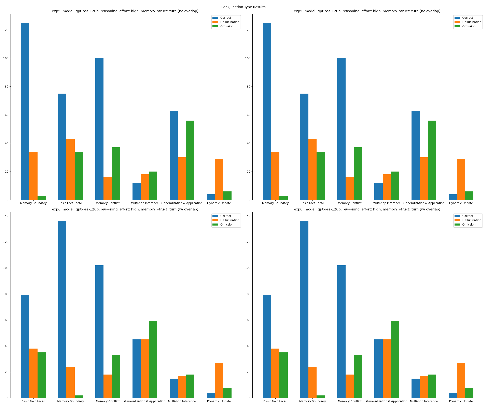

#+title: 결과 분석
#+startup: inlineimages

* 실험 세팅
일단 용어 좀 정리해 보죠.
- QA Context: 메모리를 구성하는 단계에 assistant의 질문을 답하는 유저 발언이면 해당 질문을 새 =<user><assistant>= 턴에 prepend하는 여부
  - O \to 포함
  - X \to 미포함

| Experiment | Dataset | Model        | Reasoning Effort | QA Context |
|------------+---------+--------------+------------------+------------|
| exp 5      | Medium  | gpt-oss-120b | High             | X          |
| exp 6      | Medium  | gpt-oss-120b | High             | O          |
| exp 7      | Medium  | gpt-5-mini   | Minimal          | X          |
| exp 8      | Medium  | gpt-5-mini   | Minimal          | O          |
| exp 9      | Long    | gpt-oss-120b | High             | X          |
| exp 10     | Long    | gpt-oss-120b | High             | O          |
| exp 11     | Long    | gpt-5-mini   | Minimal          | X          |
| exp 12     | Long    | gpt-5-mini   | Minimal          | O          |
* 결과 테이블
#+NAME: make-table
#+header: :prologue from tabulate import tabulate 
#+begin_src python :results output table raw :exports results
  import pandas as pd
  import json
  import os

  scores_dir = "../../scores/bm25/"
  def load_score(exp_dir):
      dired = scores_dir + f"{exp_dir}/"
      memory_type = {"bm25", "embeddings", "hybrid"}
      score_files = os.listdir(dired)
      scores = {}
      for score_file in score_files:
          model, dataset, mem_type = score_file.split('_')[:3]
          if mem_type in memory_type:
              with open(dired + score_file, "r") as file:
                  scores[mem_type] = json.load(file)
      return scores
      
  def load_scores(scores_dir):
      exp_scores = {}
      per_persona_results = {}
      for exp_dir in os.listdir(scores_dir):
          score_path = scores_dir + exp_dir
          if os.path.isdir(score_path) and (not exp_dir.startswith('_')):
              scores = load_score(exp_dir)
              if scores:
                  exp_scores[exp_dir] = {
                      key: {
                          k.split('_')[0]: v
                          for k, v in value.pop('overall_score').items()
                          if "(all)" in k
                      } for key, value in scores.items()
                  }
      return exp_scores

  def make_table(scores: dict):
      score_tables = {}
      exps = ["exp%d" % i for i in range(5, 13)]
      for exp in exps:
          exp_num = exp[-2:] if exp[-2:].isdigit() else exp[-1]
          exp_num = int(exp_num)
          exp_name = "Experiment %d" % exp_num
          for key, value in scores[exp].items():
              if score_tables.get(key) is None:
                  score_tables[key] = {}
              for k, v in value.items():
                  if score_tables[key].get(exp_name) is None:
                      score_tables[key][exp_name] = {}
                  score_tables[key][exp_name][k.capitalize()] = v * 100
      return score_tables

  scores = load_scores(scores_dir)
  score_tables = make_table(scores)
  tables = ["*** 결과"]

  for memory_type, score_table in score_tables.items():
      scores_df = pd.DataFrame(score_table).T
      column_name = memory_type.capitalize() if memory_type in {"embeddings", "hybrid"} else memory_type.upper()
      tables.append("**** " + column_name + '\n\n' + tabulate(scores_df, headers='keys', tablefmt='orgtbl', floatfmt='.2f') + '\n')

  print('\n'.join(tables))
#+end_src

#+RESULTS: make-table
*** 결과
**** BM25

|               |   Correct |   Hallucination |   Omission |
|---------------+-----------+-----------------+------------|
| Experiment 5  |     58.72 |           23.40 |      17.87 |
| Experiment 6  |     57.02 |           23.40 |      19.57 |
| Experiment 7  |     60.99 |           21.56 |      17.45 |
| Experiment 8  |     62.70 |           21.42 |      15.89 |
| Experiment 9  |     55.18 |           24.68 |      20.14 |
| Experiment 10 |     57.16 |           25.39 |      17.45 |
| Experiment 11 |     65.39 |           19.86 |      14.75 |
| Experiment 12 |     63.55 |           20.71 |      15.74 |

**** Embeddings

|               |   Correct |   Hallucination |   Omission |
|---------------+-----------+-----------------+------------|
| Experiment 5  |     51.06 |           30.78 |      18.16 |
| Experiment 6  |     51.63 |           31.06 |      17.30 |
| Experiment 7  |     52.77 |           23.83 |      23.40 |
| Experiment 8  |     54.75 |           21.28 |      23.97 |
| Experiment 9  |     50.78 |           29.36 |      19.86 |
| Experiment 10 |     49.65 |           30.50 |      19.86 |
| Experiment 11 |     53.62 |           24.40 |      21.99 |
| Experiment 12 |     53.90 |           24.96 |      21.13 |

**** Hybrid

|               |   Correct |   Hallucination |   Omission |
|---------------+-----------+-----------------+------------|
| Experiment 5  |     52.77 |           24.82 |      22.41 |
| Experiment 6  |     53.90 |           23.26 |      22.84 |
| Experiment 7  |     61.99 |           26.10 |      11.91 |
| Experiment 8  |     60.85 |           23.40 |      15.74 |
| Experiment 9  |     53.62 |           25.39 |      20.99 |
| Experiment 10 |     52.91 |           22.55 |      24.54 |
| Experiment 11 |     62.70 |           24.82 |      12.48 |
| Experiment 12 |     62.98 |           24.82 |      12.20 |

* 결과 분석
** 레이블 분포
#+NAME: label-dist-plot
#+begin_src python :results output file link :file "figs/per-result-type-distribution.png" :exports results
  import matplotlib.pyplot as plt
  import pandas as pd
  import json
  import os

  scores_dir = "../../scores/bm25/"
  def load_score(exp_dir):
      dired = scores_dir + f"{exp_dir}/"
      memory_type = {"bm25", "embeddings", "hybrid"}
      score_files = os.listdir(dired)
      scores = {}
      for score_file in score_files:
          model, dataset, mem_type = score_file.split('_')[:3]
          if mem_type in memory_type:
              with open(dired + score_file, "r") as file:
                  scores[mem_type] = json.load(file)
      return scores
      
  def load_scores(scores_dir):
      exp_scores = {}
      per_persona_results = {}
      for exp_dir in os.listdir(scores_dir):
          score_path = scores_dir + exp_dir
          if os.path.isdir(score_path) and (not exp_dir.startswith('_')):
              scores = load_score(exp_dir)
              if scores:
                  exp_scores[exp_dir] = {
                      key: { value.pop('per_persona_results')
                      } for key, value in scores.items()
                  }
      return exp_scores

  def per_type_results_df(results):
      per_type_results = {"Correct": {}, "Hallucination": {}, "Omission": {}}
      per_type_count = {}
      for result in results:
          question_type = result['question_type']
          result_type = result['result_type']
          if per_type_count.get(question_type) is None:
              per_type_count[question_type] = 0
          if per_type_results[result_type].get(question_type) is None:
              per_type_results[result_type][question_type] = 0
                
          per_type_results[result_type][question_type] += 1
          per_type_count[question_type] += 1

      df = pd.DataFrame(per_type_results)
      return df

  results = load_results(scores_dir)
  per_type_results_dist = {
      k: per_type_results_df(results[k]).T.to_dict()
      for k in results.keys()
  }

  exp_desc = {
      "exp5": {
          "model": "gpt-oss-120b",
          "reasoning_effort": "high",
          "memory_struct": "turn (no overlap)"
      },
      "exp6": {
          "model": "gpt-oss-120b",
          "reasoning_effort": "high",
          "memory_struct": "turn (w/ overlap)"
      },
      "exp7": {
          "model": "gpt-5-mini",
          "reasoning_effort": "minimal",
          "memory_struct": "turn (no overlap)"
      },
      "exp8": {
          "model": "gpt-5-mini",
          "reasoning_effort": "minimal",
          "memory_struct": "turn (w/ overlap)"
      }
  }

  fig, axes = plt.subplots(2, 2, figsize=(24, 20))
  fig.suptitle("Per Question Type Results", verticalalignment="baseline")
  for i in range(2):
      exp = list(per_type_results_dist.keys())[i]
      per_exp_result = per_type_results_dist[exp]
      question_types = list(per_exp_result.keys())

      result_types = list(list(per_exp_result.values())[0].keys())
      result = {
          k: [per_exp_result[question_type][k] for question_type in question_types]
          for k in result_types
     }

      exp_title = ""
      for k, v in exp_desc[exp].items():
          exp_title += f"{k}: {v}, "
      for j in range(2):
          axes[i][j].set_title(f"{exp}: {exp_title}")
          axes[i][j].grouped_bar(result, tick_labels=question_types)
          axes[i][j].legend()

  plt.tight_layout()
  plt.savefig("figs/per-result-type-distribution.png")
  print("figs/per-result-type-distribution.png")
#+end_src

#+RESULTS: label-dist-plot

#+NAME: label-dist-table
#+header: :prologue from tabulate import tabulate
#+begin_src python :results output table raw :exports results
  import matplotlib.pyplot as plt
  import pandas as pd
  import json
  import os

  scores_dir = "../../scores/bm25/"
  def load_score(exp_dir):
      dired = scores_dir + f"{exp_dir}/"
      memory_type = {"bm25", "embeddings", "hybrid"}
      score_files = os.listdir(dired)
      scores = {}
      for score_file in score_files:
          model, dataset, mem_type = score_file.split('_')[:3]
          if mem_type in memory_type:
              with open(dired + score_file, "r") as file:
                  scores[mem_type] = json.load(file)
      return scores

  def load_results(scores_dir):
      exp_scores = {}
      per_persona_results = {}
      for exp_dir in os.listdir(scores_dir):
          score_path = scores_dir + exp_dir
          if os.path.isdir(score_path) and (not exp_dir.startswith('_')):
              scores = load_score(exp_dir)
              if scores:
                  exp_scores[exp_dir] = {
                      key: value.pop('per_persona_results')
                      for key, value in scores.items()
                  }
      return exp_scores

  results = load_results(scores_dir)

  def per_type_results_df(results):
      per_type_results = {"Correct": {}, "Hallucination": {}, "Omission": {}}
      per_type_count = {}
      for result in results:
          question_type = result['question_type']
          result_type = result['result_type']
          if per_type_count.get(question_type) is None:
              per_type_count[question_type] = 0
          if per_type_results[result_type].get(question_type) is None:
              per_type_results[result_type][question_type] = 0
                  
          per_type_results[result_type][question_type] += 1
          per_type_count[question_type] += 1

      per_type_results["Total"] = {
          k: v for k, v in per_type_count.items()
      }

      df = pd.DataFrame(per_type_results)
      return df

  tables = ["*** 결과"]
  exps = ["exp%d" % i for i in range(5, 13)]
  for exp in exps:
      exp_num = exp[-2:] if exp[-2:].isdigit() else exp[-1]
      name = "Experiment %s" % exp_num    
      tables.append(f"**** {name}")
      for memory_type, result in results[exp].items():
          mem_type = memory_type.capitalize() if memory_type in {"hybrid", "embeddings"} else memory_type.upper()
          df = per_type_results_df(result)
          df = df.sort_values(by="Total", ascending=False)
          table = tabulate(df, headers='keys', tablefmt='orgtbl')
          tables.append(f"***** {mem_type}\n{table}\n")

  print("\n".join(tables).strip())
#+end_src

#+RESULTS: label-dist-table
*** 결과
**** Experiment 5
***** BM25
|                              |   Correct |   Hallucination |   Omission |   Total |
|------------------------------+-----------+-----------------+------------+---------|
| Memory Boundary              |       142 |              19 |          1 |     162 |
| Memory Conflict              |       113 |              20 |         20 |     153 |
| Basic Fact Recall            |        93 |              37 |         22 |     152 |
| Generalization & Application |        49 |              46 |         54 |     149 |
| Multi-hop Inference          |        13 |              17 |         20 |      50 |
| Dynamic Update               |         4 |              26 |          9 |      39 |

***** Embeddings
|                              |   Correct |   Hallucination |   Omission |   Total |
|------------------------------+-----------+-----------------+------------+---------|
| Memory Boundary              |       144 |              17 |          1 |     162 |
| Memory Conflict              |       112 |              26 |         15 |     153 |
| Basic Fact Recall            |        49 |              66 |         37 |     152 |
| Generalization & Application |        42 |              57 |         50 |     149 |
| Multi-hop Inference          |         7 |              26 |         17 |      50 |
| Dynamic Update               |         6 |              25 |          8 |      39 |

***** Hybrid
|                              |   Correct |   Hallucination |   Omission |   Total |
|------------------------------+-----------+-----------------+------------+---------|
| Memory Boundary              |       130 |              31 |          1 |     162 |
| Memory Conflict              |       104 |              18 |         31 |     153 |
| Basic Fact Recall            |        75 |              45 |         32 |     152 |
| Generalization & Application |        51 |              37 |         61 |     149 |
| Multi-hop Inference          |         8 |              21 |         21 |      50 |
| Dynamic Update               |         4 |              23 |         12 |      39 |

**** Experiment 6
***** BM25
|                              |   Correct |   Hallucination |   Omission |   Total |
|------------------------------+-----------+-----------------+------------+---------|
| Memory Boundary              |       140 |              21 |          1 |     162 |
| Memory Conflict              |       113 |              17 |         23 |     153 |
| Basic Fact Recall            |        89 |              41 |         22 |     152 |
| Generalization & Application |        45 |              44 |         60 |     149 |
| Multi-hop Inference          |        11 |              16 |         23 |      50 |
| Dynamic Update               |         4 |              26 |          9 |      39 |

***** Embeddings
|                              |   Correct |   Hallucination |   Omission |   Total |
|------------------------------+-----------+-----------------+------------+---------|
| Memory Boundary              |       142 |              19 |          1 |     162 |
| Memory Conflict              |       112 |              21 |         20 |     153 |
| Basic Fact Recall            |        45 |              75 |         32 |     152 |
| Generalization & Application |        52 |              55 |         42 |     149 |
| Multi-hop Inference          |         6 |              26 |         18 |      50 |
| Dynamic Update               |         7 |              23 |          9 |      39 |

***** Hybrid
|                              |   Correct |   Hallucination |   Omission |   Total |
|------------------------------+-----------+-----------------+------------+---------|
| Memory Boundary              |       127 |              30 |          5 |     162 |
| Memory Conflict              |       107 |              17 |         29 |     153 |
| Basic Fact Recall            |        80 |              41 |         31 |     152 |
| Generalization & Application |        43 |              32 |         74 |     149 |
| Multi-hop Inference          |        16 |              16 |         18 |      50 |
| Dynamic Update               |         7 |              28 |          4 |      39 |

**** Experiment 7
***** BM25
|                              |   Correct |   Hallucination |   Omission |   Total |
|------------------------------+-----------+-----------------+------------+---------|
| Memory Boundary              |       129 |              21 |         12 |     162 |
| Memory Conflict              |       117 |              20 |         16 |     153 |
| Basic Fact Recall            |        89 |              34 |         29 |     152 |
| Generalization & Application |        77 |              36 |         36 |     149 |
| Multi-hop Inference          |        13 |              20 |         17 |      50 |
| Dynamic Update               |         5 |              21 |         13 |      39 |

***** Embeddings
|                              |   Correct |   Hallucination |   Omission |   Total |
|------------------------------+-----------+-----------------+------------+---------|
| Memory Boundary              |       135 |              20 |          7 |     162 |
| Memory Conflict              |        96 |              28 |         29 |     153 |
| Basic Fact Recall            |        55 |              48 |         49 |     152 |
| Generalization & Application |        62 |              44 |         43 |     149 |
| Multi-hop Inference          |        18 |              13 |         19 |      50 |
| Dynamic Update               |         6 |              15 |         18 |      39 |

***** Hybrid
|                              |   Correct |   Hallucination |   Omission |   Total |
|------------------------------+-----------+-----------------+------------+---------|
| Memory Boundary              |       127 |              28 |          7 |     162 |
| Memory Conflict              |       111 |              27 |         15 |     153 |
| Basic Fact Recall            |        91 |              48 |         13 |     152 |
| Generalization & Application |        85 |              38 |         26 |     149 |
| Multi-hop Inference          |        17 |              21 |         12 |      50 |
| Dynamic Update               |         6 |              22 |         11 |      39 |

**** Experiment 8
***** BM25
|                              |   Correct |   Hallucination |   Omission |   Total |
|------------------------------+-----------+-----------------+------------+---------|
| Memory Boundary              |       137 |              19 |          6 |     162 |
| Memory Conflict              |       114 |              22 |         17 |     153 |
| Basic Fact Recall            |        89 |              36 |         27 |     152 |
| Generalization & Application |        81 |              36 |         32 |     149 |
| Multi-hop Inference          |        15 |              20 |         15 |      50 |
| Dynamic Update               |         6 |              18 |         15 |      39 |

***** Embeddings
|                              |   Correct |   Hallucination |   Omission |   Total |
|------------------------------+-----------+-----------------+------------+---------|
| Memory Boundary              |       141 |              12 |          9 |     162 |
| Memory Conflict              |       101 |              24 |         28 |     153 |
| Basic Fact Recall            |        58 |              46 |         48 |     152 |
| Generalization & Application |        66 |              41 |         42 |     149 |
| Multi-hop Inference          |        14 |              11 |         25 |      50 |
| Dynamic Update               |         6 |              16 |         17 |      39 |

***** Hybrid
|                              |   Correct |   Hallucination |   Omission |   Total |
|------------------------------+-----------+-----------------+------------+---------|
| Memory Boundary              |       125 |              25 |         12 |     162 |
| Memory Conflict              |       114 |              24 |         15 |     153 |
| Basic Fact Recall            |        86 |              41 |         25 |     152 |
| Generalization & Application |        71 |              37 |         41 |     149 |
| Multi-hop Inference          |        24 |              15 |         11 |      50 |
| Dynamic Update               |         9 |              23 |          7 |      39 |

**** Experiment 9
***** BM25
|                              |   Correct |   Hallucination |   Omission |   Total |
|------------------------------+-----------+-----------------+------------+---------|
| Memory Boundary              |       136 |              19 |          7 |     162 |
| Memory Conflict              |       106 |              23 |         24 |     153 |
| Basic Fact Recall            |        85 |              41 |         26 |     152 |
| Generalization & Application |        50 |              43 |         56 |     149 |
| Multi-hop Inference          |         8 |              22 |         20 |      50 |
| Dynamic Update               |         4 |              26 |          9 |      39 |

***** Embeddings
|                              |   Correct |   Hallucination |   Omission |   Total |
|------------------------------+-----------+-----------------+------------+---------|
| Memory Boundary              |       146 |              16 |        nan |     162 |
| Memory Conflict              |       103 |              23 |         27 |     153 |
| Basic Fact Recall            |        47 |              69 |         36 |     152 |
| Generalization & Application |        47 |              50 |         52 |     149 |
| Multi-hop Inference          |         9 |              22 |         19 |      50 |
| Dynamic Update               |         6 |              27 |          6 |      39 |

***** Hybrid
|                              |   Correct |   Hallucination |   Omission |   Total |
|------------------------------+-----------+-----------------+------------+---------|
| Memory Boundary              |       127 |              33 |          2 |     162 |
| Memory Conflict              |       111 |              17 |         25 |     153 |
| Basic Fact Recall            |        67 |              49 |         36 |     152 |
| Generalization & Application |        55 |              35 |         59 |     149 |
| Multi-hop Inference          |        12 |              17 |         21 |      50 |
| Dynamic Update               |         6 |              28 |          5 |      39 |

**** Experiment 10
***** BM25
|                              |   Correct |   Hallucination |   Omission |   Total |
|------------------------------+-----------+-----------------+------------+---------|
| Memory Boundary              |       139 |              21 |          2 |     162 |
| Memory Conflict              |       110 |              22 |         21 |     153 |
| Basic Fact Recall            |        85 |              41 |         26 |     152 |
| Generalization & Application |        51 |              49 |         49 |     149 |
| Multi-hop Inference          |        13 |              20 |         17 |      50 |
| Dynamic Update               |         5 |              26 |          8 |      39 |

***** Embeddings
|                              |   Correct |   Hallucination |   Omission |   Total |
|------------------------------+-----------+-----------------+------------+---------|
| Memory Boundary              |       144 |              17 |          1 |     162 |
| Memory Conflict              |       107 |              22 |         24 |     153 |
| Basic Fact Recall            |        46 |              73 |         33 |     152 |
| Generalization & Application |        41 |              53 |         55 |     149 |
| Multi-hop Inference          |         7 |              27 |         16 |      50 |
| Dynamic Update               |         5 |              23 |         11 |      39 |

***** Hybrid
|                              |   Correct |   Hallucination |   Omission |   Total |
|------------------------------+-----------+-----------------+------------+---------|
| Memory Boundary              |       124 |              32 |          6 |     162 |
| Memory Conflict              |       107 |              16 |         30 |     153 |
| Basic Fact Recall            |        75 |              32 |         45 |     152 |
| Generalization & Application |        53 |              35 |         61 |     149 |
| Multi-hop Inference          |        11 |              18 |         21 |      50 |
| Dynamic Update               |         3 |              26 |         10 |      39 |

**** Experiment 11
***** BM25
|                              |   Correct |   Hallucination |   Omission |   Total |
|------------------------------+-----------+-----------------+------------+---------|
| Memory Boundary              |       146 |              12 |          4 |     162 |
| Memory Conflict              |       119 |              19 |         15 |     153 |
| Basic Fact Recall            |        91 |              33 |         28 |     152 |
| Generalization & Application |        85 |              34 |         30 |     149 |
| Multi-hop Inference          |        14 |              22 |         14 |      50 |
| Dynamic Update               |         6 |              20 |         13 |      39 |

***** Embeddings
|                              |   Correct |   Hallucination |   Omission |   Total |
|------------------------------+-----------+-----------------+------------+---------|
| Memory Boundary              |       137 |              20 |          5 |     162 |
| Memory Conflict              |        97 |              30 |         26 |     153 |
| Basic Fact Recall            |        59 |              48 |         45 |     152 |
| Generalization & Application |        63 |              40 |         46 |     149 |
| Multi-hop Inference          |        16 |              14 |         20 |      50 |
| Dynamic Update               |         6 |              20 |         13 |      39 |

***** Hybrid
|                              |   Correct |   Hallucination |   Omission |   Total |
|------------------------------+-----------+-----------------+------------+---------|
| Memory Boundary              |       136 |              23 |          3 |     162 |
| Memory Conflict              |       110 |              27 |         16 |     153 |
| Basic Fact Recall            |        88 |              45 |         19 |     152 |
| Generalization & Application |        79 |              41 |         29 |     149 |
| Multi-hop Inference          |        21 |              14 |         15 |      50 |
| Dynamic Update               |         8 |              25 |          6 |      39 |

**** Experiment 12
***** BM25
|                              |   Correct |   Hallucination |   Omission |   Total |
|------------------------------+-----------+-----------------+------------+---------|
| Memory Boundary              |       139 |              15 |          8 |     162 |
| Memory Conflict              |       115 |              21 |         17 |     153 |
| Basic Fact Recall            |        91 |              33 |         28 |     152 |
| Generalization & Application |        81 |              41 |         27 |     149 |
| Multi-hop Inference          |        17 |              16 |         17 |      50 |
| Dynamic Update               |         5 |              20 |         14 |      39 |

***** Embeddings
|                              |   Correct |   Hallucination |   Omission |   Total |
|------------------------------+-----------+-----------------+------------+---------|
| Memory Boundary              |       138 |              20 |          4 |     162 |
| Memory Conflict              |       100 |              26 |         27 |     153 |
| Basic Fact Recall            |        51 |              54 |         47 |     152 |
| Generalization & Application |        70 |              44 |         35 |     149 |
| Multi-hop Inference          |        16 |              15 |         19 |      50 |
| Dynamic Update               |         5 |              17 |         17 |      39 |

***** Hybrid
|                              |   Correct |   Hallucination |   Omission |   Total |
|------------------------------+-----------+-----------------+------------+---------|
| Memory Boundary              |       133 |              24 |          5 |     162 |
| Memory Conflict              |       110 |              31 |         12 |     153 |
| Basic Fact Recall            |        90 |              40 |         22 |     152 |
| Generalization & Application |        81 |              39 |         29 |     149 |
| Multi-hop Inference          |        23 |              16 |         11 |      50 |
| Dynamic Update               |         7 |              25 |          7 |      39 |
